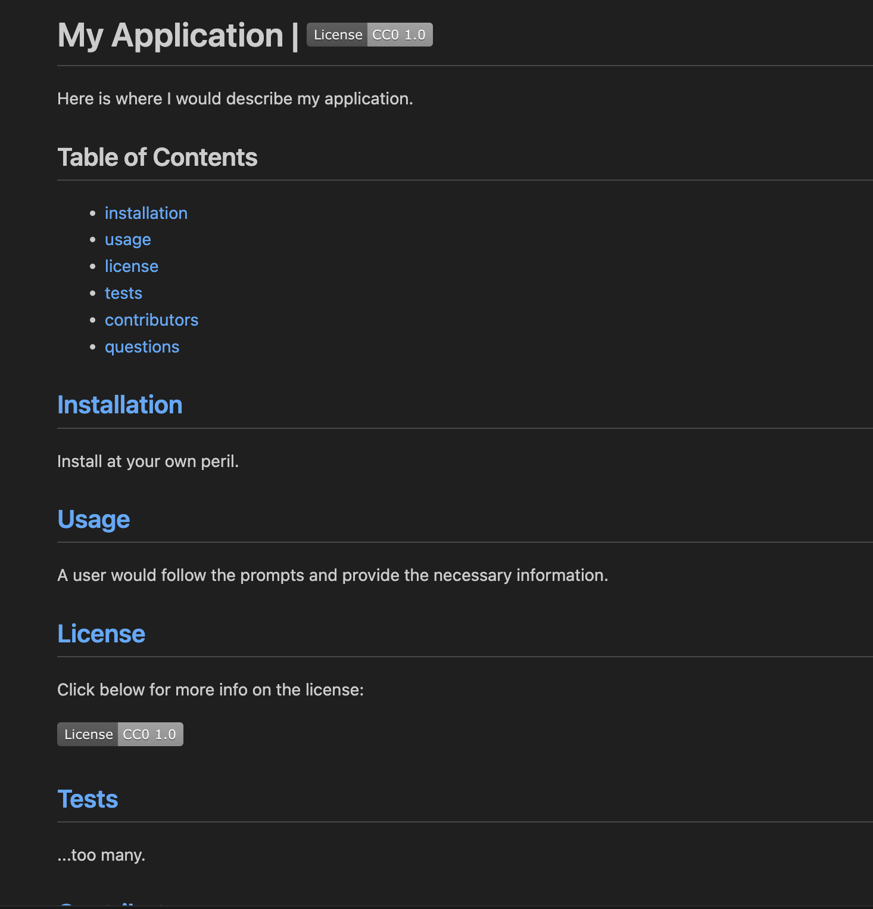

# Module 09 Homework - Node.JS

For this assignment, I created a node.js application for generating README files with the following functionality:

### QUESTIONS.JS
- Used node.js inquirer prompts (such as "input" & "list" prompts) to gather information the user enters into node.
- Created a licenseChoices array to store the id name & badges for the license prompt.
- Used licenseChoices.map to attach the associated badge information with the chosen license name. This way, when the user selects a badge name when selecting an input at the license prompt, the badge will be generated on the markdown page.
- Exported the getQuestions () method to INDEX.JS using module.exports on line 152.

### MARKDOWN.JS
- Used a template literal inside the generateMarkdown () method to style and format the markdown file.
- Referenced the "responses" variable from INDEX.JS, I used template literal tags to display the data inside the markdown file.
- Used anchor tags in table of contents to jump to different areas of the page. Also tagged each header tag to jump back up to table of contents for more larger pages.
- Linked the license badges (next to the title & inside the "License" section) with the necessary license information.
- Added links to my Github & email address inside the "Questions" section.
- Exported generateMarkdown() to INDEX.JS using module.exports on line 52.

### INDEX.JS
- Linked two separate javascript files (MARKDOWN.JS & QUESTIONS.JS) here, using destructed arrays exported from these separate files.
- Using the exported getQuestions () and user's data from the async inquirer prompts from QUESTIONS.JS, the start() method executes a writeFile () to generate the specified markdown file.
- Generates console.log success or failure messages to confirm whichever action occurs.

## Link to Video Walkthrough

[Click here to see the deployed version](https://drive.google.com/file/d/148_WES1qpzCQaI1Hy2sfdF-yJIS5brjl/view)

## Screenshot of the Deployed Version

